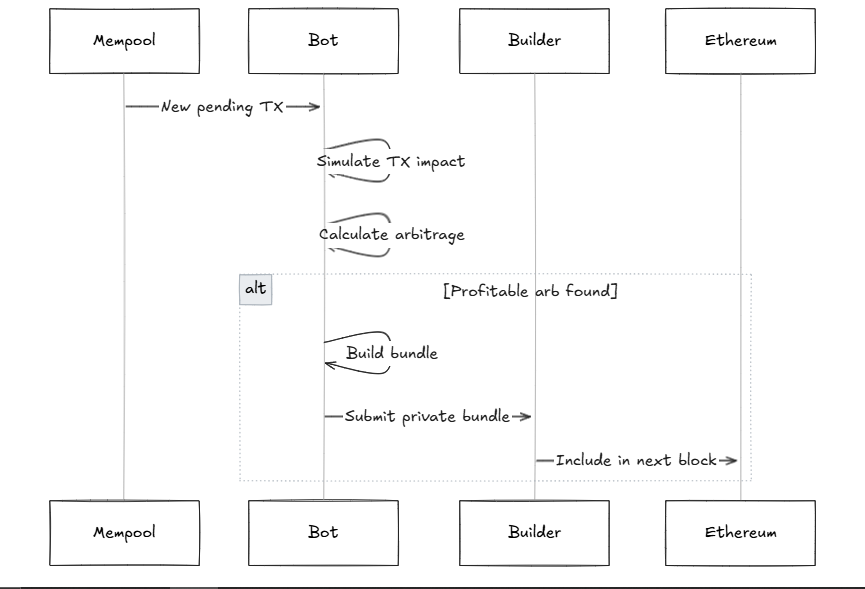

# Backrunner Strategy

A MEV strategy that identifies and executes profitable arbitrage opportunities by backrunning transactions in the mempool, specifically focusing on Uniswap and Curve protocol interactions.

## Architecture



The strategy consists of several key components that work together:

1. **Event Monitoring & Processing**
   - `events.py` - Handles blockchain event subscriptions and processing
   - `pending.py` - Processes pending transactions from mempool
   - Filters for relevant DEX interactions

2. **Pool Management & State**
   - `pool_manager.py` - Manages pool states and updates
   - `ethereum_lp_fetcher_curve1.py` - Handles Curve LP interactions
   - `ethereum_parse_spool_curve1.py` - Parses Curve pool data

3. **Strategy Implementation**
   - `strategy.py` - Core strategy logic and coordination
   - `types.py` - Type definitions for strategy components
   - `config.py` - Strategy configuration management

4. **Transaction Processing**
   - `simulation.py` - Simulates transaction bundles using Anvil fork
   - `builders.py` - Handles MEV builder interactions
   - `ethereum_executor.py` - Manages transaction execution

5. **Safety & Monitoring**
   - `blacklist.py` - Manages blacklisted pools and tokens
   - `tracker.py` - Tracks system health and balances

## Usage

1. Set up environment variables in `mainnet_full.env`
2. Initialize the strategy:

```python
from strategy.backrunner import BackrunnerStrategy
from api.uniswap import UniswapAPI

async def main():
    api = UniswapAPI()
    config = BackrunnerConfig(...)
    strategy = BackrunnerStrategy(config, api)
    await strategy.init()
    await strategy.execute()
```

## Strategy Flow

1. **Mempool Monitoring**
   - Watch for pending transactions
   - Filter for DEX interactions
   - Track pool state changes

2. **Opportunity Detection**
   - Analyze transaction impact
   - Calculate potential arbitrage paths
   - Validate profitability estimates

3. **Transaction Execution**
   - Build optimized bundles
   - Simulate execution
   - Submit to MEV builders

## Configuration

Key settings in `mainnet_full.env`:
- Node connections (HTTP/WebSocket/IPC)
- Contract addresses
- Gas parameters
- Builder endpoints
- Network configuration

## Safety Features

- Blacklist management for risky pools/tokens
- Pre-execution simulation
- Balance tracking
- Health monitoring
- Gas optimization with access lists

## Dependencies

- Web3.py - Blockchain interaction
- Aiohttp - Async HTTP requests
- UJson - JSON handling
- Anvil - Transaction simulation

## Development Status

- Core functionality implemented
- In active development
- Testing phase pending
- Gas optimization ongoing
- Safety mechanisms in place

## Notes

- Requires Ethereum node with archive data
- Performance depends on network conditions
- Consider MEV competition when configuring
- Currently focused on Uniswap/Curve interactions